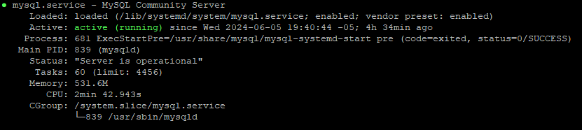

# MySql Ubuntu22.04
Guía para instalar y configurar MySql en un servidor privado virtual que ejecuta la distribución Ubuntu. Requiere usuario 'root'.

## Instalación

Primero actualizaremos e instalaremos paquetes nuevos. Para ello ejecutaremos los siguientes comandos:

```bash
sudo apt update
```
```bash
sudo apt upgrade
```
Después de actualizar los paquetes procederemos a instalar MySql con los siguientes comandos:

```bash
sudo apt install mysql-server
```
Durante la instalación tendremos que confirmar algunos cambios. Para ello escribiremos 'Y' en la terminal cuando nos pida.

Una vez terminado la instalación de MySql procederemos a verificar si está funcionando correctamente con el siguiente comando:
```bash
sudo systemctl status mysql
```



## Usage

```python
import foobar

# returns 'words'
foobar.pluralize('word')

# returns 'geese'
foobar.pluralize('goose')

# returns 'phenomenon'
foobar.singularize('phenomena')
```

## Contributing

Pull requests are welcome. For major changes, please open an issue first
to discuss what you would like to change.

Please make sure to update tests as appropriate.

## License

[MIT](https://choosealicense.com/licenses/mit/)