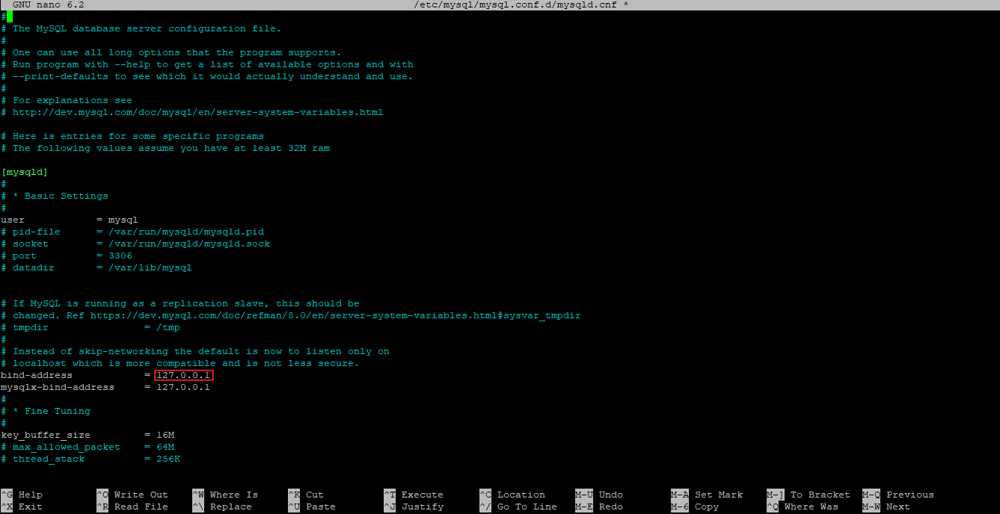
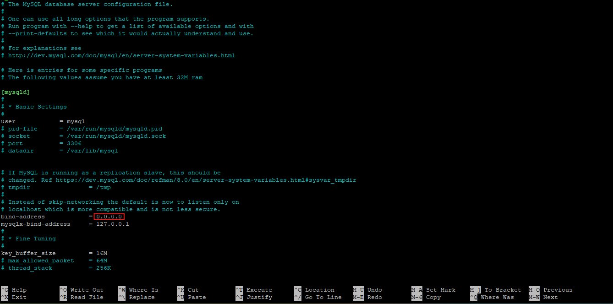

# MySQL Ubuntu 22.04
Guía para instalar, crear usuarios y aceptar conexiones remotas en MySQL.

* Requiere Ubuntu 22.04
* Requiere usuario 'root' de la terminal

## Instalación

Primero actualizaremos e instalaremos paquetes nuevos. Para ello ejecutaremos los siguientes comandos en la terminal.

```bash
sudo apt update
```
```bash
sudo apt upgrade
```
Después de actualizar los paquetes procederemos a instalar MySQL poniendo el siguiente comando en la terminal.

```bash
sudo apt install mysql-server
```
Durante la instalación tendremos que confirmar algunos cambios. Para ello escribiremos 'Y' en la terminal cuando nos pida.

Una vez terminado la instalación de MySql procederemos a verificar si está funcionando correctamente con el siguiente comando:
```bash
sudo systemctl status mysql
```
Si nos sale un mensaje igual que el siguiente, la Instalación fue correcta. Cerramos el mensaje presionando las teclas "Ctrl + C" a la vez.


## Crear nuevo usuario en MySQL 

Entramos a MySQL escribiendo el siguiente comando en la terminal.
```bash
mysql
```
Cuado ingresemos el comando anterior accederemos a la consola de MySQL, ingresamos el siguiente comando en la consola para crear un nuevo usuario:

```bash
create user 'tuusuario'@'%' identified by 'tucontraseña';
```
* Reemplaza 'tuusuario' por tu usuario y 'contraseña' por tu contraseña. 
* No elimines los apostrofes ( ' ).

Daremos todos los permisos al nuevo usuario con los siguientes comandos:

```bash
grant all privileges on *.* to 'tuusuario'@'%' with grant option;
```
## Configurar usuario 'root' en MySQL 

Entramos a MySQL poniendo el siguiente comando en la terminal.

```bash
mysql
```

Entramos a MySQL con el siguiente comando

* Eliminar el usuario 'root'.

```bash
drop user 'root'@'localhost';
```
* Crear el usuario 'root'.

```bash
create user 'root'@'localhost' identified by 'tucontraseña';
```
* Reemplaza por tu 'tucontraseña' por tu contraseña. 
* No elimines los apostrofes ( ' ).

Damos todos los permisos al usuario 'root' con el siguiente comando.
```bash
grant all privileges on *.* to 'root'@'%' with grant option;
```
Salimos de la consola de MySQL con el siguiente comando:

```bash
exit
```
Reiniciamos MySQL con el siguiente comando.
```bash
sudo systemctl restart mysql
```
A partir de ahora para acceder a MySQL tendremos que ejecutar el siguiente comando en la terminal. Reemplaza por tu usuario

```bash
mysql -u usuario -p
```
Para que nos deje ingresar tendremos que poner la contraseña del respectivo usuario. Una vez que ingresemos la contreña estaremos dentro de la consola de MySQL

## Configurar conexiones remotas en MySQL
* Requiere usuario 'root'

Estando en la terminal, colocamos el siguiente comando.
```bash
nano /etc/mysql/mysql.conf.d/mysqld.cnf
```
Nos saldrá lo mismo que la siguiente imagen



Nos desplazamos con las flechas de nuestro teclado hasta la linea siguiente.

* bind-address       = 127.0.0.1 

Remplazamos '127.0.0.1' por '0.0.00'. Tal como la siguiente imagen.

## License

[MIT](https://choosealicense.com/licenses/mit/)